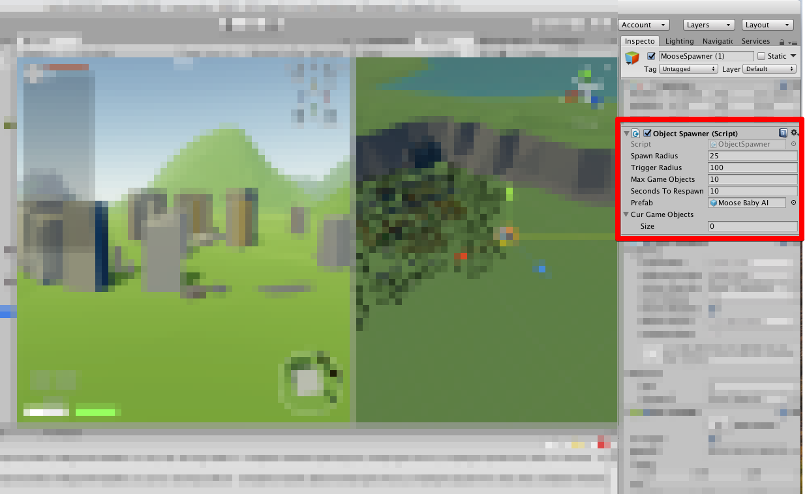

# Dynamic Object Spawner

Demo                       |
:-------------------------:|
 |
The number of destroyed objects was set to all but one, and as soon as the respawn time was reached and the player re-entered the spawn trigger, all previously destroyed objects respawned.

## Getting Started
### Prerequisites
- [Unity](https://unity3d.com/)
- A Built [NavMesh](https://docs.unity3d.com/Manual/nav-BuildingNavMesh.html) in your scene

### Installation

1. Add `Spawner/ObjectSpawner.cs` to your project.
2. Ensure your player is tagged `Player` or change this code in `ObjectSpawner.cs` if you want your player to be named something else
3. Ensure your player has some Collider (with `Is Trigger` unchecked) and a Rigidbody.
4. Add `Spawner/ObjectSpawner.prefab` to your project, and update the Script settings in Unity's Inspector window to use the prefab you want to be spawned in. Check out the [Customization](#Customization) header for more details.

## Customization
Unity's Inspector Window         |
:-------------------------------:|
 |
- <b>Spawn Radius</b>: The radius that you want the objects to spawn within. The objects will spawn in random locations between the radius and the ObjectSpawner.
- <b>Trigger Radius</b>: The radius the trigger extends to. When the players distance to the the ObjectSpawner is within the `Trigger Radius`, the objects are spawned in. When the player leaves this radius, the Objects are destroyed from the scene until the player re-enters the radius.
- <b>Max Game Objects</b>: How many objects the Spawner can spawn in.
- <b>Seconds To Respawn</b>: How long until destroyed Game Objects respawn. The objects will never respawn while the player is within the `Trigger Radius`. The player must leave the `Trigger Radius` and then as soon as the player goes back within the `Trigger Radius`, the spawner checks how many objects to spawn back in by determining if objects have been destroyed for longer than `Seconds to Respawn`
- <b>Prefab</b>: A prefab of the Game Object you want to spawn in.
- <b>Cur Game Objects</b>: A list of the Game Objects the spawner currently holds. Everytime an object is spawned, ObjectSpawner holds a reference to its location within this list.
